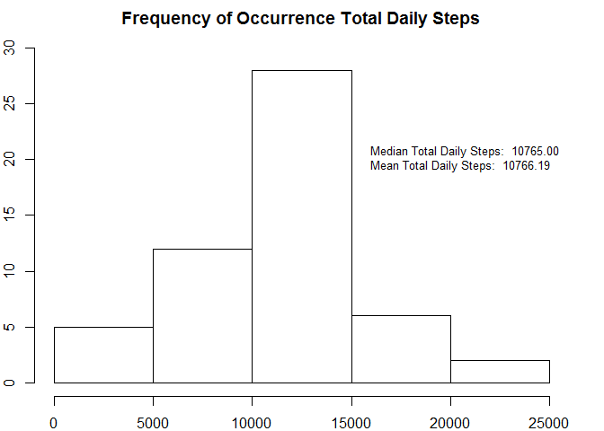
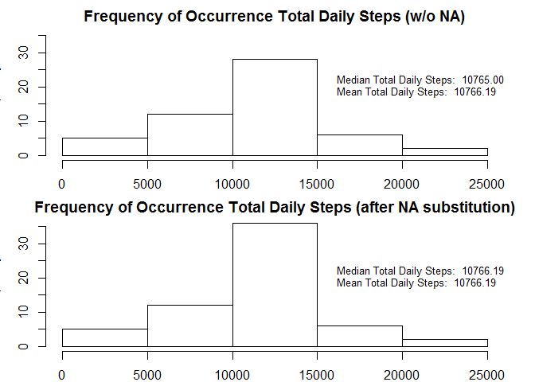

# Reproducible Research: Peer Assessment 1


## Loading and preprocessing the data

Check for existence of activity.csv in current directory.  If it does not exist, check for existence of zip file in activity directory.  If it does not exist, download from URL indicated in code.  Unzip the activity.zip file to create activity.csv.  Read the csv file; use stringsAsFactors specific to the date column to avoid reading in as factor.


```r
if (!file.exists("activity.csv")) {
  fileURL <- "http://d396qusza40orc.cloudfront.net/repdata%2Fdata%2Factivity.zip"
  if (!file.exists("activity.zip")) {
    download.file(fileURL, "activity.zip")
  }
  unzip("activity.zip","activity.csv")
}

activity <- read.csv("activity.csv",header=TRUE,sep=",",stringsAsFactors=FALSE)
```


## What is mean total number of steps taken per day?
In order to calculate, all NA values for steps will be ignored.  Data is grouped by date, and then the sum of all steps within date are calculated. Mean and median are calculated across the population of total daily steps. Base plotting system is leveraged to provide a histogram representing the frequency of total daily steps across all days in the original dataset.


```r
library(dplyr)
```

```
## 
## Attaching package: 'dplyr'
## 
## The following object is masked from 'package:stats':
## 
##     filter
## 
## The following objects are masked from 'package:base':
## 
##     intersect, setdiff, setequal, union
```

```r
totaldata <- activity[!is.na(activity$steps),] %>%
  group_by(date) %>%
  summarize(dateTotal=sum(steps)) 

stepmean <- sprintf("%.2f",mean(totaldata$dateTotal))
stepmed <- sprintf("%.2f",median(totaldata$dateTotal))

op <- par(mar=c(2,2,2,2))
hist(totaldata$dateTotal, ylim=c(0,30), main="Frequency of Occurrence Total Daily Steps", xlab="Total Daily Steps")
text(stepmed,20,paste("Median Total Daily Steps: ",stepmed,"\nMean Total Daily Steps: ",stepmean),pos=4,offset=6,cex=.8)
```

 

```r
par(op)
```


## What is the average daily activity pattern?
In order to calculate, all NA values for steps will be ignored.  Data is grouped by interval, and the average of all steps within interval are calculated.  Base plotting system is leveraged to provide time series graph of the average steps by interval for the dataset excludng NA's.


```r
resultdata <- activity[!is.na(activity$steps),] %>%
  group_by(interval) %>%
  summarize(avgSteps=mean(steps)) 

maxAvg <- resultdata$avgSteps[which.max(resultdata$avgSteps)]
maxInt <- resultdata$interval[which.max(resultdata$avgSteps)]
maxIntTime <- sprintf("%04d",maxInt)
maxIntTime <- paste0(substr(maxIntTime,1,2),":",substr(maxIntTime,3,4))

op <- par(mar=c(2,2,2,2))
plot(resultdata$interval,resultdata$avgSteps,type="l", main="Average Number of Daily Steps by 5 Minute Interval", xlab="Daily Intervals", ylab="Average Steps Per Interval", sub="Interval notation represents HH:MM")
text(maxInt,maxAvg,paste("Max Avg Steps ",sprintf("%.2f",maxAvg)," occurs at interval: ",maxInt," (",maxIntTime,")"),cex=.8)
```

 

```r
par(op)
```


     
# Inputing missing values
Previous grouping and calculations of average steps per interval is leveraged to substitute NA step values within intervals.  For all NA values, the matching interval to the internal of the missing value is identified in order to leverage the average steps for the data population in that interval as replacement value.


```r
paste("Total number of missing values: ",sum(is.na(activity$steps)))
```

```
## [1] "Total number of missing values:  2304"
```


```r
activity2 <- activity
activity2$steps[is.na(activity2$steps)] <- resultdata$avgSteps[match(activity2$interval[is.na(activity2$steps)],resultdata$interval)]
```

Panel plot is created showing the original histogram before replacement of NA values in comparison with the histogram after replacement.  Grouping of data for the dataset with NA values utilizes same grouping pattern previously used with NA's to support caculating new mean and median of population after replacement.


```r
totaldata2 <- group_by(activity2, date) %>%
  summarize(dateTotal=sum(steps)) 

stepmean2 <- sprintf("%.2f",mean(totaldata2$dateTotal))
stepmed2 <- sprintf("%.2f",median(totaldata2$dateTotal))

op <- par(mfrow=c(2,1),mar=c(2,3,2,2))
hist(totaldata$dateTotal, ylim=c(0,35), main="Frequency of Occurrence Total Daily Steps (w/o NA)", xlab="Total Daily Steps")
text(stepmed,20,paste("Median Total Daily Steps: ",stepmed,"\nMean Total Daily Steps: ",stepmean),pos=4,offset=6,cex=.8)

hist(totaldata2$dateTotal, ylim=c(0,35), main="Frequency of Occurrence Total Daily Steps (after NA substitution)", xlab="Total Daily Steps")
text(stepmed2,20,paste("Median Total Daily Steps: ",stepmed2,"\nMean Total Daily Steps: ",stepmean2),pos=4,offset=6,cex=.8)
```

 

```r
par(op)
```

The average total daily steps taken after NA replacement does not change.  This would be expected and can be shown algebraically to be accurate expectation when leveraging the previous interval averages for interval NA step replacement values.  The median over all intervals is now equivalent to the mean.  Although not anticipated, it does seem reasonable given that mean and median were very close to one another previously, and more occurrences will now have same mean value given the type of replacement done.


## Are there differences in activity patterns between weekdays and weekends?

Weekday is first determined by converting date column from character to POSIXlt utilizing strptime function, and then leveraging weekdays function.  Those weekdays that match Saturday/Sunday are set as Weekend; all others become Weekday. Data is grouped by interval and weekday factor.  Average number of steps is calculated within each grouping.  qplot is leveraged with facets option to display comparable graphs for weekday vs weekend.


```r
totaldata2 <- mutate(activity2,weekday=weekdays(strptime(date, "%Y-%m-%d"))) %>%
  mutate(weekday=as.factor(ifelse(weekday %in% c("Saturday","Sunday"),"Weekend","Weekday"))) %>%
  group_by(interval,weekday) %>%
  summarize(avgSteps=mean(steps)) 

library(ggplot2)
print(qplot(interval,avgSteps,data=totaldata2,geom="line",
           main="Comparison Average Daily Steps Weekday vs Weekend",
           xlab="Daily Intervals",ylab="Average Steps per Interval",
           sub="Interval notation represents HH:MM",facets=weekday~.))
```

 

Weekday activity reaches a max value earlier than weekend activity, and max value is a higher value especially in comparison to remainder of day.  This would align to start of workday, preparation for work, and travel to work.  Remainder of each day for weekday becomes more sedentary representative of typical office worker environment with long hours sitting.  Weekend activity shows later start and then more consistent, sustained activity at higher levels than weekday.  This would be expected given many individuals tend to sleep later on weekends, and then fill their day with errands and recreational activities.


