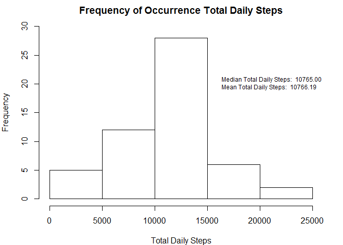
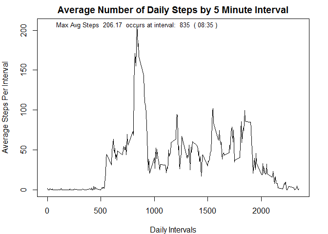
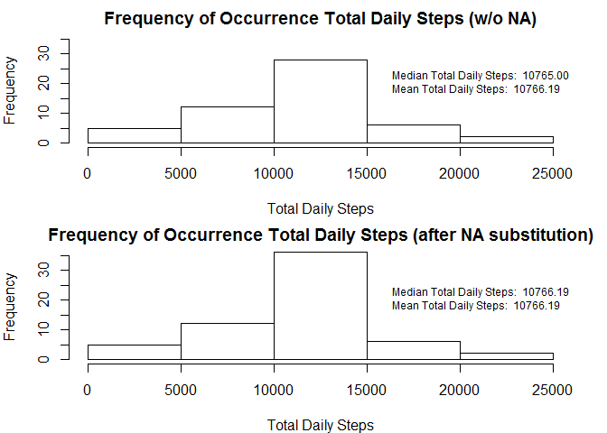
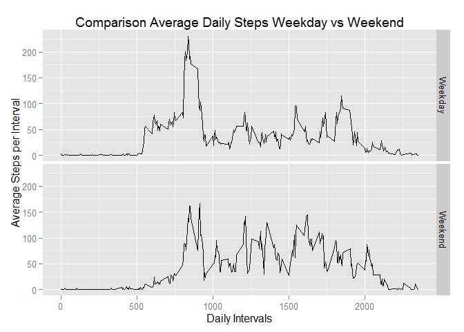

# Reproducible Research: Peer Assessment 1


## Loading and preprocessing the data

The dataset required for this analysis is activity.csv, and can be obtained by downloading and unzipping the associated zip file from http://d396qusza40orc.cloudfront.net/repdata%2Fdata%2Factivity.zip.  This analysis document is designed to complete all file download and read actions as part of the analysis.  The script checks for existence of activity.csv in current directory.  If it does not exist, script then checks for existence of zip file in current directory.  If it does not exist, script downloads the zip file from URL indicated, and unzips to create the activity.csv file.  Analysis script then reads the csv file with the parameter stringsAsFactors=FALSE specific to the date column to avoid reading in as factor to simplify subsequent steps in formatting the value.  
  

```r
if (!file.exists("activity.csv")) {
  fileURL <- "http://d396qusza40orc.cloudfront.net/repdata%2Fdata%2Factivity.zip"
  if (!file.exists("activity.zip")) {
    download.file(fileURL, "activity.zip")
  }
  unzip("activity.zip","activity.csv")
}

activity <- read.csv("activity.csv",header=TRUE,sep=",",stringsAsFactors=FALSE)  
```
  
  
  
## What is mean total number of steps taken per day?
In order to calculate mean total number of steps taken per day, all NA values for steps will initially be ignored.  This is accomplished by subsetting the data read from activity.csv to exclude NA values for steps.  Data is grouped by date, and then the sum of all steps within date are calculated. Mean and median are calculated across the population of total daily steps. The base plotting system in R is leveraged to provide a histogram representing the frequency of total daily steps across all days in the original dataset.  All data cleaning steps are completed using functions from the dplyr library.  Analysis script installs and loads library if not already installed.  Subsequent analysis steps will leverage the qplot function with ggplot2 library.  This is also loaded at this time for simplicity.  The code to complete this is shown however the messages generated by R as these steps are completed have been hidden for clarity in report.  
  

```r
if(!is.element('dplyr', installed.packages()[,1]))
  {install.packages('dplyr')
}
library(dplyr)
if(!is.element('ggplot2', installed.packages()[,1]))
  {install.packages('ggplot2')
}
library(ggplot2)
```


```r
totaldata <- activity[!is.na(activity$steps),] %>%
  group_by(date) %>%
  summarize(dateTotal=sum(steps)) 

stepmean <- sprintf("%.2f",mean(totaldata$dateTotal))
stepmed <- sprintf("%.2f",median(totaldata$dateTotal))

op <- par(mar=c(4,4,2,2))
hist(totaldata$dateTotal, ylim=c(0,30), main="Frequency of Occurrence Total Daily Steps", xlab="Total Daily Steps")
text(stepmed,20,paste("Median Total Daily Steps: ",stepmed,"\nMean Total Daily Steps: ",stepmean),pos=4,offset=6,cex=.75)
```

 

The mean total number of steps taken per day, 10766.19, is displayed as text in the above histogram along with the median, 10765.  
    

```r
par(op)  # reset plotting parameters to original values
```
  
    
## What is the average daily activity pattern?
  
In order to calculate average daily activity patterns, all NA values for steps taken will be ignored at this time.  This is accomplished by subsetting the data read from activity.csv to exclude NA values for steps.  Data is grouped within the daily 5 minute intervals specified in dataset, and the average of all steps within interval are calculated.  Base plotting system is leveraged to provide time series graph of the average steps by interval for the subsetted dataset excludng NA's.  Text is annotated to the displayed graph to indicate what the maximum average steps within intervals is along with the time interval in which this occurred.  The 5 minute intervals from the original dataset represent military time with first 2 characters the hour, and the last 2 characters the minutes.  This representation is leveraged to format the hour of occurrence of the maximum average steps.  
  
  

```r
resultdata <- activity[!is.na(activity$steps),] %>%
  group_by(interval) %>%
  summarize(avgSteps=mean(steps)) 

maxAvg <- resultdata$avgSteps[which.max(resultdata$avgSteps)]
maxInt <- resultdata$interval[which.max(resultdata$avgSteps)]
maxIntTime <- sprintf("%04d",maxInt)
maxIntTime <- paste0(substr(maxIntTime,1,2),":",substr(maxIntTime,3,4))

op <- par(mar=c(4,4,2,2))
plot(resultdata$interval,resultdata$avgSteps,type="l", main="Average Number of Daily Steps by 5 Minute Interval", xlab="Daily Intervals", ylab="Average Steps Per Interval", sub="Interval notation represents HH:MM")
text(maxInt,maxAvg,paste("Max Avg Steps ",sprintf("%.2f",maxAvg)," occurs at interval: ",maxInt," (",maxIntTime,")"),cex=.8)
```

 

Maximum average daily steps of 206.17 occurs at 8:35am.  
  

```r
par(op)  # reset plotting parameters to original values
```
  
  
     
# Inputting missing values
For purposes of replacing missing step values, this analysis script replaces missing values within each interval with the average steps per interval previously derived.  This approach is preferable to using other statistics such as the average steps per day as it more closely aligns to the variations that would be seen throughout the day within specific intervals.  Previous grouping dataframe and calculations of average steps per interval are leveraged in this analysis to simplify the substitution for NA step values within intervals.  For all NA values, the time interval of the missing value is identified.  This value is then leveraged to find the interval match from the earlier dataframe summarizing average steps within interval.  
  

```r
paste("Total number of missing values: ",sum(is.na(activity$steps)))
```

```
## [1] "Total number of missing values:  2304"
```

The total number of missing values is calculated for validation purposes.  Number of values requiring substitution is 2304.  
  
A copy of the original activity data frame is generated for this substitution step.  This is done to enable comparison graph of the before and after to be shown later in this analysis. Subsetting is leveraged to identify the specific elements to be replaced.  These are then replaced by the comparable interval values from the summary grouping data completed previously.  
  

```r
activity2 <- activity
activity2$steps[is.na(activity2$steps)] <- resultdata$avgSteps[match(activity2$interval[is.na(activity2$steps)],resultdata$interval)]
```
  

```r
paste("Total number of missing values: ",sum(is.na(activity2$steps)))
```

```
## [1] "Total number of missing values:  0"
```

The total number of missing values after substitution is calculated for validation purposes.  Result is 0 substantiating that all NA values have been replaced.  
  
Panel plot is created showing the original histogram before replacement of NA values in comparison with the histogram after replacement.  Grouping of data for the dataset with NA values utilizes same grouping pattern by date previously used with NA's to support caculating new mean and median of population after replacement.  
  
  

```r
totaldata2 <- group_by(activity2, date) %>%
  summarize(dateTotal=sum(steps)) 

stepmean2 <- sprintf("%.2f",mean(totaldata2$dateTotal))
stepmed2 <- sprintf("%.2f",median(totaldata2$dateTotal))

op <- par(mfrow=c(2,1),mar=c(4,4,2,2))
hist(totaldata$dateTotal, ylim=c(0,35), main="Frequency of Occurrence Total Daily Steps (w/o NA)", xlab="Total Daily Steps")
text(stepmed,20,paste("Median Total Daily Steps: ",stepmed,"\nMean Total Daily Steps: ",stepmean),pos=4,offset=6,cex=.75)

hist(totaldata2$dateTotal, ylim=c(0,35), main="Frequency of Occurrence Total Daily Steps (after NA substitution)", xlab="Total Daily Steps")
text(stepmed2,20,paste("Median Total Daily Steps: ",stepmed2,"\nMean Total Daily Steps: ",stepmean2),pos=4,offset=6,cex=.75)
```

 
  
The average total daily steps taken after NA replacement does not change.  This would be expected and can be shown algebraically to be accurate expectation when leveraging the previous interval averages for interval NA step replacement values. The median over all intervals is now equivalent to the mean.  Although not at first anticipated, it does seem reasonable given that mean and median were very close to one another previously, and more occurrences will now exist with same mean value given the type of replacement completed.  
  

```r
par(op)  # reset plotting parameters to original values
```
  
  
## Are there differences in activity patterns between weekdays and weekends?
  
Weekday is first determined by converting date column in dataset from character to POSIXlt utilizing strptime function in R, and then leveraging weekdays function.  Those weekdays that match Saturday/Sunday are set as Weekend; all others become Weekday. Data is grouped by interval and weekday factor.  Average number of steps is calculated within each grouping.  The qplot function from the ggplot2 library is leveraged with facets option to display comparable graphs for weekday vs weekend.  
  

```r
totaldata2 <- mutate(activity2,weekday=weekdays(strptime(date, "%Y-%m-%d"))) %>%
  mutate(weekday=as.factor(ifelse(weekday %in% c("Saturday","Sunday"),"Weekend","Weekday"))) %>%
  group_by(interval,weekday) %>%
  summarize(avgSteps=mean(steps)) 

print(qplot(interval,avgSteps,data=totaldata2,geom="line",
           main="Comparison Average Daily Steps Weekday vs Weekend",
           xlab="Daily Intervals",ylab="Average Steps per Interval",
           sub="Interval notation represents HH:MM",facets=weekday~.))
```

 
  
Weekday activity appears to reach a maximum value for the day slightly earlier than weekend activity.  The maximum average steps per interval value following that initial maximum are noticably smaller for remainder of weekday.  This would align to start of workday, preparation for work, and travel to work. Remainder of each day for weekday becomes more sedentary representative of typical office worker environment with long hours sitting.  Weekend activity shows later start and then more consistent, sustained activity at higher levels throughout intervals than occur on the weekday.  This would be expected given many individuals tend to sleep later on weekends, and then fill their day with errands and recreational activities.  
